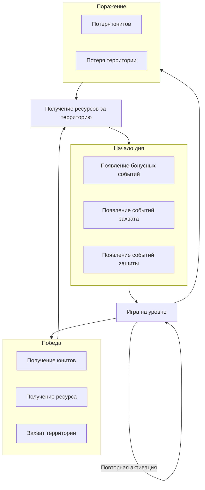

---
tags:
  - checkpoint
  - meet
  - todo
date: 2025-06-12
dg-publish: true
---
# General
Главный герой: колдун
Место: глубинка белорусской деревни
Время: 1914-е-1937-е #todo 
# Внешняя карта
Рефференс - Aztez
[[8 встреча#История деревни с фронтами]]]
![[Aztez Map.png]]
## Суть Aztez-like
В игре есть набор локаций, и они могут быть в опасности. Если локация в опасности, то игроку могут предложить попробовать её предотвратить.
Уровень- это игра на определённой локации.
### Безопасные
Локации ничего не угрожает 
### Опасные
Локация, у которой есть проблема. В ближайшее время станет терминальной, если ничего не делать
### Терминальные
Проблема перешла в терминальную стадию, исправление которой или трудно исправимо, или неисправимо
## Loop

