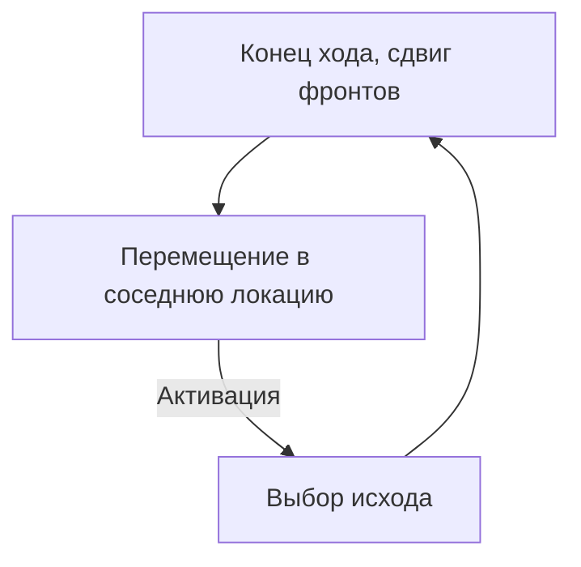
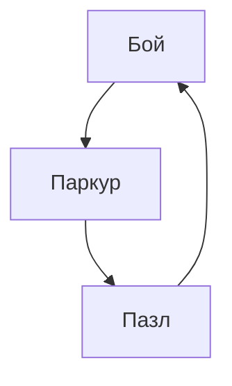
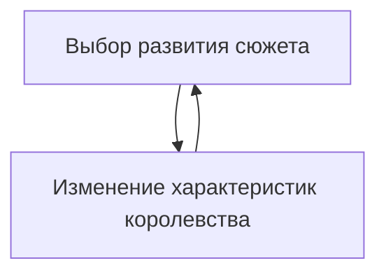
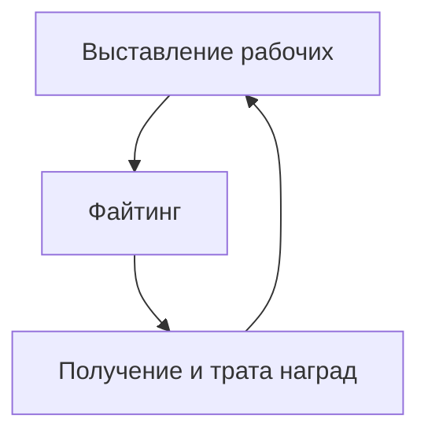
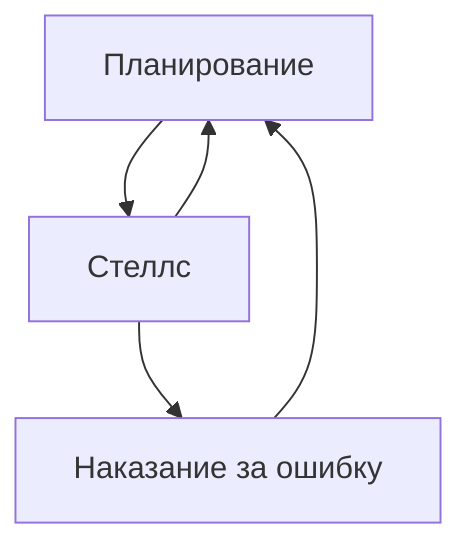
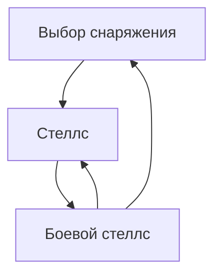

# Прототип

# Приключенческий жанр

# Reigns

Эта часть цикла на данный момент целиком видится командой в игре в том или ином виде.
# Aztez

По сути, Файтинг сегмент совсем необязателен. Его можно заменить на что угодно (например, на stealth-action сегменты)
# Shadow tactics

Планирование: глазик (видеть всех, кто видит эту точку), остановка времени, планирование одновременных действий.
Наказание: потеря хп. тревога, рестарт уровня.
# Intravenous

Выбор снаряжения в этой игре важен, т.к. именно оно определяет возможности героя решать различные ситуации.
Суть боевого стеллса в том, что уже идёт бой, но у игрока преимущество в том, что NPC до конца не знают, где сейчас главный герой
